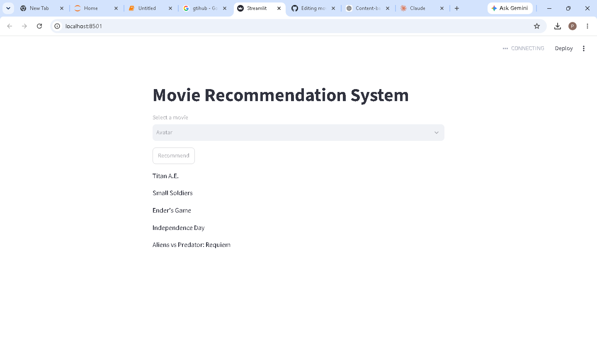

# 🎬 CineMatch — Movie Recommendation System

A presentation-ready **content-based movie recommendation website** built with Python, Scikit-learn, Pandas, and Streamlit.

CineMatch lets a user select a movie and instantly returns five similar titles. Recommendations are based on movie metadata such as genres, keywords, cast, crew, and overview.

## 🌐 Live demo

### [🚀 Open CineMatch Movie Recommendation Website](https://movie-recommendation-system12324.streamlit.app/)



## ✨ Features

- Polished, responsive cinema-style interface
- Searchable movie selector
- Five recommendation cards
- Content-based recommendations generated with CountVectorizer and cosine similarity
- Cached data and feature matrix for faster repeat use
- Friendly loading and error states
- No external API key required

## 🧠 How it works

1. Movie metadata is cleaned in `preprocessing.ipynb`.
2. Genres, keywords, cast, director, and overview are combined into a `tags` column.
3. CountVectorizer converts the tags into a sparse feature matrix.
4. Cosine similarity compares the selected movie with the catalogue.
5. The five closest matches are displayed in the Streamlit website.

Unlike the earlier version, the app calculates only the similarity scores it needs. It does **not** require a large `similarity.pkl` file.

## 🛠️ Tech stack

- Python
- Pandas and NumPy
- Scikit-learn
- NLTK
- Streamlit
- Pickle

## 📁 Project structure

```text
movie-recommendation-system2/
├── app.py
├── movies.pkl
├── preprocessing.ipynb
├── requirements.txt
├── movie_screenshot.png
├── README.md
└── LICENSE
```

## ▶️ Run locally

```bash
git clone https://github.com/priyanka12324/movie-recommendation-system2.git
cd movie-recommendation-system2
pip install -r requirements.txt
streamlit run app.py
```

The application opens at `http://localhost:8501`.

## 📊 Dataset and preprocessing

The preprocessing notebook is based on the TMDB movie dataset. If you want to rebuild `movies.pkl`, download the required TMDB movie and credits CSV files, place them in the project folder, and run `preprocessing.ipynb`.

The generated `movies.pkl` must contain at least these columns:

- `title`
- `tags`

## ☁️ Deployment

The application is deployed on Streamlit Community Cloud:

**Live website:** [movie-recommendation-system12324.streamlit.app](https://movie-recommendation-system12324.streamlit.app/)

No API keys or secrets are required.

## 🔮 Future improvements

- Add movie posters, ratings, and trailers through the TMDB API
- Add genre and language filters
- Add user favourites
- Compare CountVectorizer with TF-IDF or transformer embeddings
- Add recommendation evaluation metrics

## 👩‍💻 Author

**Priyanka Rawat**  
B.Tech CSE (AI & ML)  
[GitHub](https://github.com/priyanka12324)
